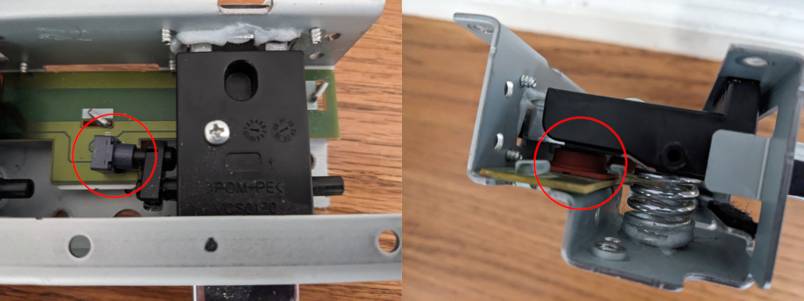
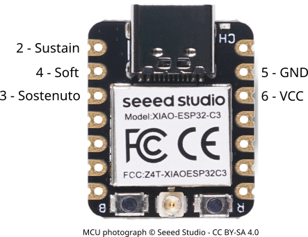
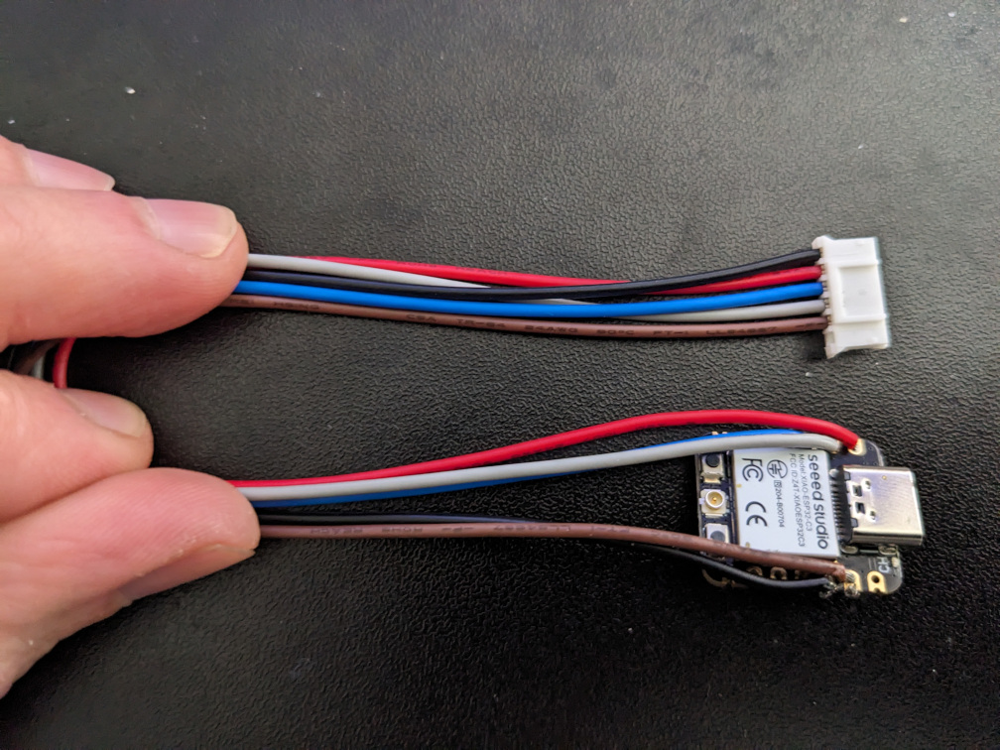
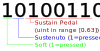

# Yamaha Pedal Unit Microcontroller

This project provides an interface between Yamaha pedal units and USB host devices (like a personal computer).

## Circuitry

The pedal unit exposes its connections via a 6-pin rectangular cable connector (2mm pitch).
Many Yamaha pianos accept a 6-pin Mini-DIN connector instead of a rectangular connector, so the included cable is often rectangular-to-Mini-DIN.

The pins are extremely simple.
From left to right (looking at the cable connector head-on), the pins are: voltage, sustain, sostenuto, soft, and ground.

Individual pedals work either as a switch (button) or a potentiometer (variable resistance).
For a pot pedal, the voltage on the pedal's wire will increase the more the pedal is pressed (i.e. resistance decreases as the pedal is pressed further down).
For a switch pedal, the voltage on the pedal's wire will average to ~50% of the supply voltage when the pedal is released, and will drop to about ~1% when pressed (i.e. the switch is "normally closed").
Note the "average" in the last sentence: In practice, the reading may fluctuate between high and low resistance, sometimes multiple times a second.
To account for this, we average the voltage over multiple readings in order to determine if a switch pedal is pressed or not.

Depending on the pedal unit, the pedals that have a button and the ones that have a pot may differ.
In the unit I have (from a Yamaha CLP-745), the soft and sostenuto pedals have buttons, while the sustain pedal has a pot.
The pot has about 8kΩ resistance when released and 4kΩ when fully pressed.
This translates to a reading of between ~25% and ~95% of supply voltage, depending on how far the pedal is pressed.

A supply voltage of 3.3V is known to work well with these pedals - experiment with other power setups at your own risk.

For more information on real-world testing and different possible pedal configurations, Piano World has [a great thread discussing experiments with these types of pedal units](https://forum.pianoworld.com/ubbthreads.php/topics/3216656/).

## Microcontroller

Given the relatively low wire count, a small USB-powered controller MCU is perfect for this application, such as the [XIAO ESP32C3](https://wiki.seeedstudio.com/XIAO_ESP32C3_Getting_Started/).
(For a more featureful implementation, such as emulating a USB HID, go for an ESP32S3 or similar instead, since the ESP32C3 does not have a native USB device stack.)
Each pedal pin is hooked up to an ADC pin on the MCU in order to get more accurate readings from the switch pedals, and to be able to use the pot pedals _at all_.

[A simple Arduino program](pedals.ino) allows converting the readings from the pedals into data that can be sent over the wire to a host system.
Since the switch pedals may have unstable readings (mentioned above), it's best to average readings over a rolling time window.

In the example program, the MCU writes a byte of data over a serial interface representing the state of the pedals.
This data is written whenever the state of the pedals change.

A more powerful MCU is perfectly capable of running this code with a more advanced output protocol, such as emulating a USB HID or MIDI device.
